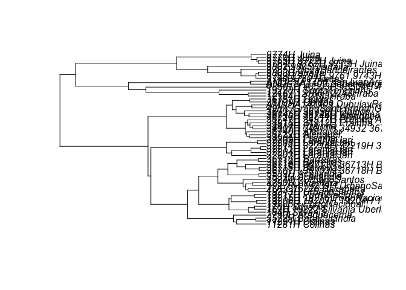
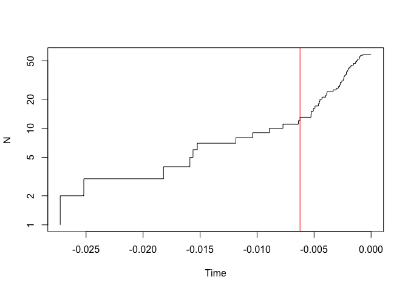

<!-- README.md is generated from README.Rmd. Please edit that file -->

# sGMYC: GMYC analysis with subsampling

<!-- badges: start -->
<!-- badges: end -->

sGMYC runs a single-threshold GMYC analysis (Pons et al. 2006) using the
splits package (Fujisawa & Barraclough 2013) with subsamples of
sequences obtained from within the species delimited using all
sequences. It also plots a heatmap of conspecificity probabilities among
samples based on functions of the bGMYC package (Reid & Carstens 2012).
When more than one tree are provided, sGMYC can implement the analysis
with multiple cores using the parallel and doParallel packages.

## Installation

You can install the development version from
[GitHub](https://github.com/) with:

``` r
# install.packages("devtools")
devtools::install_github("arleyc/sGMYC")
```

## Example: full GMYC analysis vs. subsampling with sGMYC

1)  Full analysis with bGMYC

``` r
library(sGMYC)

data("hypotree")

library(bGMYC)
#> Loading required package: ape
#> 
#> Attaching package: 'bGMYC'
#> The following object is masked from 'package:sGMYC':
#> 
#>     spec.probmat

fullgmyc<-bgmyc.singlephy(hypotree, mcmc=10000, burnin=2500, thinning=50)
#> You are running bGMYC on a single phylogenetic tree.
#> This tree contains  58  tips.
#> The Yule process rate change parameter has a uniform prior ranging from  0  to  2 .
#> The coalescent process rate change parameter has a uniform prior ranging from  0  to  2 .
#> The threshold parameter, which is equal to the number of species, has a uniform prior ranging from  2  to  51 . The upper bound of this prior should not be more than the number of tips in your trees.
#> The MCMC will start with the Yule parameter set to  1 .
#> The MCMC will start with the coalescent parameter set to  0.5 .
#> The MCMC will start with the threshold parameter set to  50 . If this number is greater than the number of tips in your tree, an error will result.
#> Given your settings for mcmc, burnin and thinning, your analysis will result in  150  samples being retained.
#> !!!!!!!!!!!!!!!!!!!!!!!!!!!!!!!!!!!!!!!!!!!!!!!!!!!!!!!!!!!!
#> is.binary.tree() is deprecated; using is.binary() instead.
#> 
#> is.binary.tree() will be removed soon: see ?is.binary and update your code.
#> !!!!!!!!!!!!!!!!!!!!!!!!!!!!!!!!!!!!!!!!!!!!!!!!!!!!!!!!!!!!
#> 10 % 
#> 20 % 
#> 30 % 
#> 40 % 
#> 50 % 
#> 60 % 
#> 70 % 
#> 80 % 
#> 90 % 
#> 100 % 
#> acceptance rates 
#>  py pc th 
#>  0.8145 0.762 0.3514

fullgmyc.probmat<-bGMYC::spec.probmat(fullgmyc)

plot.bgmycprobmat(fullgmyc.probmat,hypotree)
```



2)  Subsampling with sGMYC

``` r

myres<-sGMYC(hypotree)
#> Subsampling of tree 1, Done!
#> 
#>  Number of species in full analysis vs. after subsampling 
#>        full_GMYC min_sGMYC max_sGMYC mean_sGMYC sd_sGMYC #reps #subsamp per sp
#> Tree 1        12         2         2          2        0   100               2
#> 
#>  Number of species vs. number of subsampling replicates 
#> $`Tree 1`
#>   #species #reps
#> 1        2   100

#Calculate matrix of conspecificity probabilities

myprobmat<-sGMYC::spec.probmat(myres)

#Plot heatmap of conspecificity probabilities

plot.bgmycprobmat(myprobmat,hypotree)
```



``` r
#Species delimitation with subsampling using multiple trees and computer cores

#Plotting heatmap of conspecificity probabilities
```

## References

Fujisawa T & Barraclough TG. 2013. Delimiting species using single-locus
data and the Generalized Mixed Yule Coalescent approach: A revised
method and evaluation on simulated data sets. Systematic Biology
62:707–724, doi: 10.1093/sysbio/syt033

Pons J, Barraclough TG, Gomez-Zurita J, Cardoso A, Duran DP, Hazell S,
Kamoun S, Sumlin WD & Vogler AP. 2006. Sequence-based species
delimitation for the DNA taxonomy of undescribed insects. Systematic
Biology 55:595-609, doi: 10.1080/10635150600852011.

Reid NM & Carstens BC. 2012. Phylogenetic estimation error can decrease
the accuracy of species delimitation: a Bayesian implementation of the
general mixed Yule-coalescent model. BMC Evolutionary Biology 12:196,
doi: 10.1186/1471-2148-12-196.

## Citation

de Magalhães RF, Santos MTT & Camargo A. 2024. Subsampling GMYC (sGMYC):
a new algorithmic implementation of the generalized mixed
Yule-coalescent model. I Congresso Brasileiro de Biologia Evolutiva,
Curitiba, Brasil.
